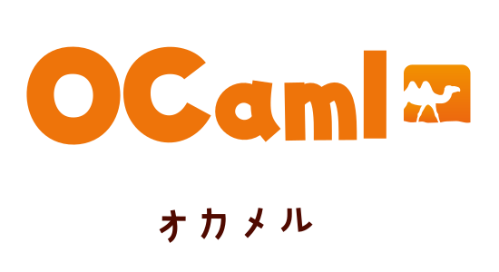

# Kawaii Logos

> [!WARNING]
> All images in this repository are original works created solely by Rin.  
> They are not affiliated with, endorsed by, or associated with any organisation, project, company, or trademarked entity.

> [!IMPORTANT]
> The contents of this repository may not be used, in whole or in part, for the purpose of training, fine-tuning, evaluating, or otherwise improving machine learning or generative models.  
> Please enjoy these images for their intended purpose, which is to enhance your personal projects, blog posts, laptop stickers, etc.

## License
### Permitted Use
- You may freely use the images for personal, non-commercial purposes, such as blog posts, personal websites, printing stickers or posters, etc.  
  Attribution is not required, but is appreciated.
- Source files are included in this repository and you can modify them as you like for personal use, but you may not redistribute derivative works in any form.

### Prohibited Use
- Unless you have obtained explicit permission, you may not use the logos in this repository for commercial purposes. This includes, but is not limited to, using the logos in advertisements, on merchandise for sale, etc.
- If applicable, the recognised organisation for a depicted project may freely use the corresponding logo for secondary purposes.
- You may not claim authorship of the images or present them as your own work.
- As noted above, use of the images or source files for machine learning, dataset creation, or other AI-related purposes is strictly prohibited.
- Rin shall not be held liable for any damages or losses arising from the use of these materials.

## Acknowledgements
Inspired by [Sawaratsuki](https://github.com/SAWARATSUKI/KawaiiLogos/), who created cute logos for programming languages and tools.

Created in Inkscape, a free and open-source vector graphics editor.
Source files are included to allow personal modification in accordance with the licence above.

# Gallery

## HoTT

## Agda

## Haskell

## OCaml

